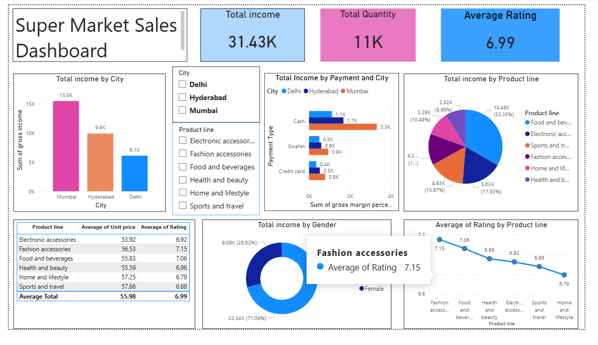

# 📊 Sales Dashboard - Power BI

## 🔍 Overview

This project is a Power BI dashboard developed to analyze sales data and generate meaningful business insights. It helps in understanding sales performance, trends, and regional distribution.

## 🎯 Objectives

* Analyze overall sales performance
* Identify top-performing regions and products
* Track monthly and yearly sales trends

## 📊 Key Insights

* Certain regions contribute higher revenue compared to others
* Sales vary across different months showing seasonal trends
* A few products generate the majority of profit

## 📈 Features

* KPI cards (Total Sales, Profit, Orders)
* Interactive filters (Region, Date)
* Visualizations such as bar charts, line charts, and pie charts

## 🛠 Tools & Technologies

* Microsoft Power BI
* Microsoft Excel

## 📂 Files Included

* [Sales_Dashboard.pbix](./Sales_Dashboard.pbix) → Main Power BI report

## 📸 Dashboard Preview

## 🌐 Live Dashboard

Currently not publicly available. Please download the `.pbix` file to view the dashboard.

## 🚀 How to Use

1. Download the `.pbix` file
2. Open it using Power BI Desktop
3. Explore the dashboard and interact with filters

## 👤 Author

**Tejeswarreddy**
